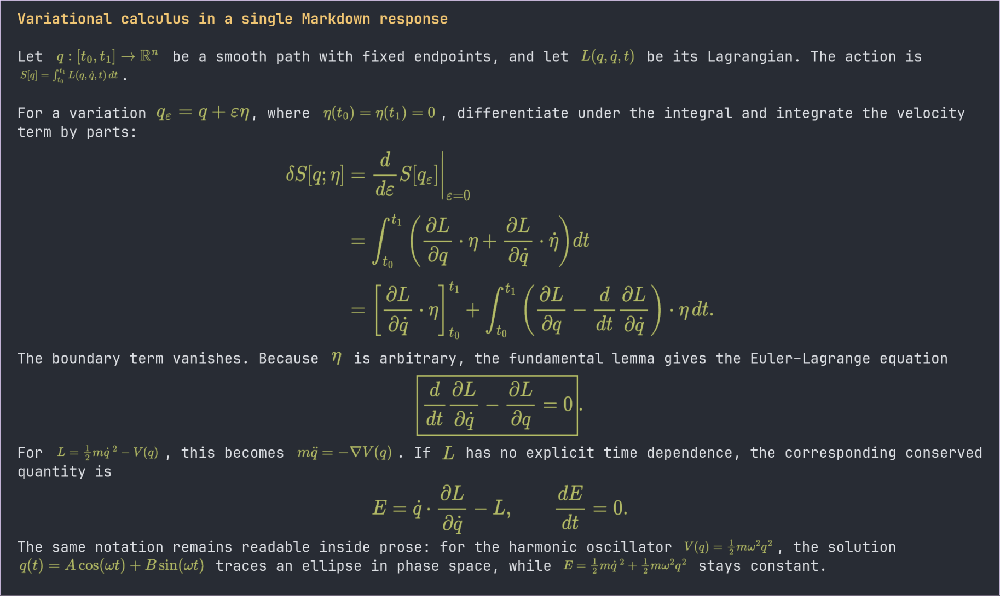

# pi-math

Render LaTeX in the Pi TUI as real, transparent terminal images.

pi-math uses MathJax for mathematical typesetting and Resvg for rasterization. It does not approximate formulas with Unicode glyphs or hand-built character geometry.



## Features

- Genuine LaTeX layout through MathJax SVG
- Transparent, theme-colored PNG output through Resvg
- True inline image formulas in Kitty and Ghostty through Unicode virtual placements
- Compatible Kitty graphics and iTerm2 display-image placement through Pi TUI
- Inline delimiters: `$...$` and `\(...\)`
- Display delimiters: `$$...$$` and `\[...\]`
- Common display environments, including `equation`, `align`, `aligned`, `gather`, matrices, and cases
- Native MathJax support for fractions, roots, scripts, limits, scalable fences, `\boxed`, and nested structures
- One consistent base formula size across messages
- Minimum necessary proportional shrinking when a formula exceeds the content width
- Cell-aware centering and automatic rerendering after terminal resize
- Alpha-bound clipping detection, dynamic raster density, and transparent safety bleed
- Separate byte-bounded SVG and PNG caches
- Configurable TeX macros, environments, font files, and cross-platform system-font discovery
- Original LaTeX fallback when image rendering or a formula is unsupported
- Display-only transformation: stored messages and model context are never rewritten
- Local, in-process rendering with no browser, network request, or child process at runtime

## Requirements

- Pi 0.80.6 or newer
- Node.js 22.19 or newer
- A terminal image protocol recognized by Pi:
  - Full inline and display rendering: Ghostty and Kitty
  - Display rendering plus compatibility inline placement: WezTerm and Warp
  - Display rendering: iTerm2

Pi intentionally disables terminal images inside tmux and screen. In those environments, and in terminals without a supported image protocol, pi-math leaves the original LaTeX visible.

## Installation

Clone the repository into Pi's global extension directory:

```bash
git clone https://github.com/Fadouse/pi-math.git \
  ~/.pi/agent/extensions/pi-math
cd ~/.pi/agent/extensions/pi-math
npm install --omit=dev
```

Or keep the checkout elsewhere and symlink it:

```bash
cd /path/to/pi-math
npm install --omit=dev
ln -sfn "$PWD" ~/.pi/agent/extensions/pi-math
```

Reload Pi after installation:

```text
/reload
```

Pi discovers `src/index.ts` through the `pi.extensions` field in `package.json`.

## Usage

Use normal LaTeX delimiters in user or assistant messages:

```markdown
Euler's identity is $e^{i\pi}+1=0$.

\[
x=\frac{-b\pm\sqrt{b^2-4ac}}{2a}
\]

\[
\begin{aligned}
f(x)&=(x-a)q(x)+r,\\
f(a)&=r.
\end{aligned}
\]
```

Ghostty and Kitty render embedded formulas as real one-row image cells, so prose, punctuation, and list items remain intact. Standalone and display formulas use centered image blocks. Other terminals use the safest protocol-specific behavior available; the Markdown source always remains unchanged.

## Commands

```text
/math-render status   Show protocol, raster count, cache bytes, and last failure
/math-render on       Enable image rendering
/math-render off      Disable image rendering
/math-render clear    Clear formula and Markdown transform caches
```

Rendering is enabled by default.

## Sizing behavior

Every formula starts at the same base scale: `0.50 × terminal cell height` pixels per MathJax `ex`.

- Formulas that fit use that scale unchanged.
- Formulas are never enlarged to fill available space.
- An overwide formula is reduced only enough to fit the current Markdown content width.
- Width and height always use the same scale, preserving the complete formula's aspect ratio.
- The raster is padded, not stretched, to an exact integer number of terminal cells.
- Embedded inline formulas are proportionally contained in one terminal row so they can share a line with text.
- Small rasters use 2× device density; exceptionally large terminal canvases fall back to 1× instead of failing.

Resizing the terminal creates a layout-specific render. A formula returns to the base scale whenever the wider content area can contain it.

## Optional configuration

Configuration is read when the extension loads:

```text
PI_MATH_MACROS          JSON object of MathJax configmacros definitions
PI_MATH_ENVIRONMENTS    JSON object of MathJax custom environment definitions
PI_MATH_FONT_FILES      Font files separated by the platform path delimiter
PI_MATH_SYSTEM_FONTS    true/false; enabled by default for Unicode text fallback
```

Macro names may be written with or without the leading backslash. Explicit font files are validated before renderer initialization. System font discovery is performed in-process by Resvg and contains no platform-specific hardcoded paths. Reload Pi after changing these variables.

## Fallback behavior

pi-math leaves the original delimiters and LaTeX visible when:

- Pi reports no supported image protocol;
- rendering is disabled with `/math-render off`;
- MathJax rejects incomplete or unsupported input;
- a safety limit is exceeded; or
- the renderer cannot initialize on the current platform.

Fallback is source-preserving; there is no Unicode approximation path.

## How it works

```text
Markdown LaTeX
    ↓ protected span detection
MathJax TeX → SVG
    ↓ fixed scale or minimum width fit
Resvg → transparent PNG on an integer-cell canvas
    ↓
Pi TUI image placement
    ↓
Kitty Unicode placeholders / Kitty graphics / iTerm2 images
```

Pi does not currently expose a renderer override for ordinary user and assistant messages. pi-math therefore installs a reversible wrapper around `Markdown.render()`. It swaps protected markers into the render pass, inserts terminal image sequences, and restores the original Markdown before returning.

See [Architecture](docs/ARCHITECTURE.md) for module boundaries, cache behavior, sizing invariants, and failure handling.

## Development

```bash
npm install
npm run check
npm run visual -- gallery
npm run visual -- radical
npm run visual -- aligned
npm run visual -- complex
npm run visual -- theory
npm run visual -- inline
```

Set `MATH_WIDTH` to exercise a specific Markdown width:

```bash
MATH_WIDTH=60 npm run visual -- theory
```

The automated suite covers MathJax rasterization, transparent ink bounds, fixed and width-limited scales, one-row inline fitting, dynamic raster density, tall formulas, macros, tags, Unicode text, malformed-input diagnostics, nested/commented TeX scanning, Markdown code exclusion, Kitty Unicode placeholders, Kitty/iTerm2 compatibility placement, capability fallback, resize layout, byte-bounded LRU behavior, cache stability, source restoration, and patch removal.

## Runtime dependencies

- [MathJax 3](https://github.com/mathjax/MathJax-src) — TeX parsing and SVG layout, Apache-2.0
- [Resvg JS](https://github.com/yisibl/resvg-js) — in-process SVG rasterization, MPL-2.0

`@resvg/resvg-js` uses platform-specific native packages. Installation must include the matching optional dependency for the target operating system and architecture.

## License

pi-math is available under the [MIT License](LICENSE).

Copyright (c) 2026 Fadouse.
